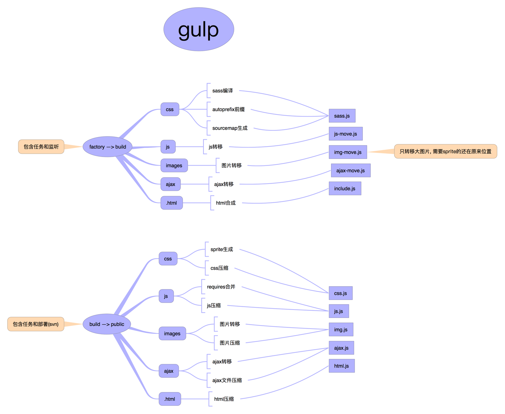

# guorenbao(果仁宝)

> 果仁宝官网项目, 前端: 张树垚 ([ccforeverd](https://github.com/ccforeverd))

### 文件结构

### gulp结构

### 一些说明

第一次制作工程化项目, 走了不少弯路也踩了不少坑, 但最终完成时还是非常有成就感的.

里面有些规划和想法可能并不成熟, 能够改进的地方还有很多, 重在坚持.

### 参考资料

- [__前端工程——基础篇__](https://github.com/fouber/blog/issues/10#)
